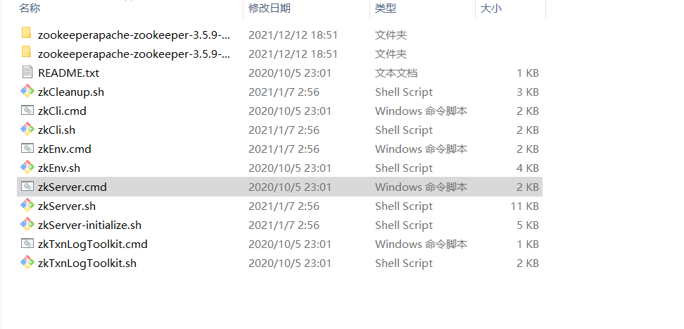
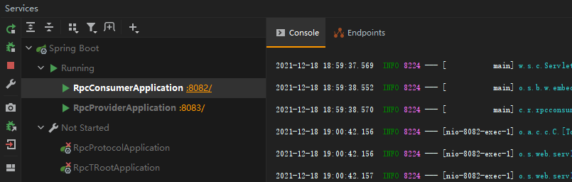
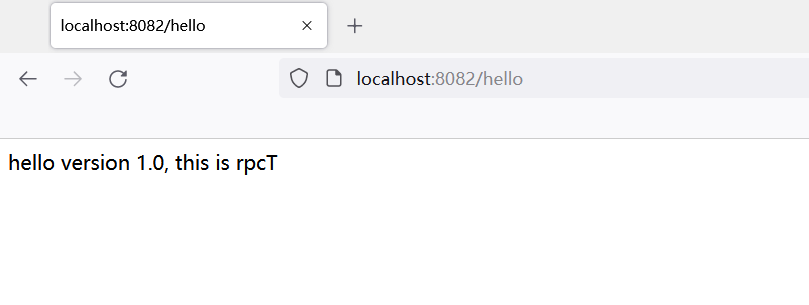
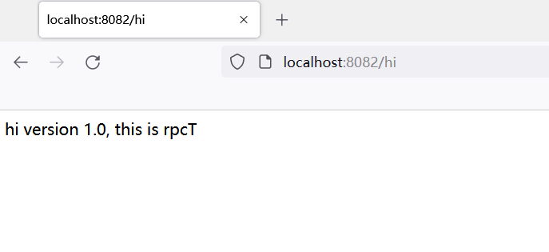

# 项目简介
本项目实现了一个简单的 RPC 框架，主要包括客户端，服务端，注册中心三部分。
# 开发工具
开发采用工具和平台包括：
* 开发平台：IDEA;
* 主要工具：springboot+netty+zookeeper;
* 序列化方案：Hessian.
# 主要功能
1. 服务端启动后将服务注册至 zookeeper 管理下的注册中心;
2. 客户端接受用户访问请求，查询注册中心得到目标服务的服务端地址;
3. 向服务端发起请求，客户端与服务端通过 netty 实现通讯，实现自定义协议;
4. 服务端响应请求并向反馈到客户端;
5. 客户端将响应反馈给用户.
# 项目重点
netty 通信，动态代理，zookeeper 负载均衡，序列化是项目的重点。
# 功能演示
首先启动本地的zookeeper服务端zkServer，注意地址要和项目中 application.properties 文件中定义的保持一致：

---

---
接着先后启动 rpcProvider 和 rpcConsumer Application：

---

---
在浏览器输入地址，访问定义在 rpcConsumer 中的 server.port 以及提供的服务地址：

---

---

---

